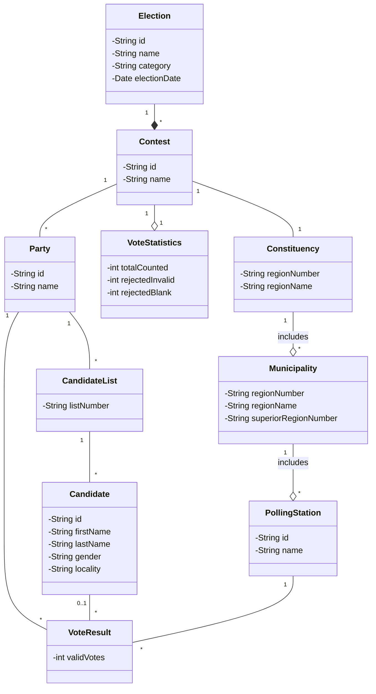

## UML Class diagram 

We hadden feedback gekregen dat de class diagram niet zou werken bij een gemeenteraads verkiezing,
dat de benaaming van de realties beter verwoord konden worden en dat de kandidaten boven de partijen
moesten staan om dat meerdere kandidaten een partij vormen. We hebben die feedback verwerkt en de 
benaming van de relaties aangepast. Maar we hebben ervoor gekozen om de andere feedback niet aan te
passen omdat we hebben gekeken naar de xml sturctuur en daar staan de partijen boven de kandidaten.
Kandidaten zijn daar dus onderdeel van een partij. Ook gaan we het diagram niet aanpassen naar 
gemeenteraadsverkiezingen omdat dat niet is waar we met onze applicatie op focussen.