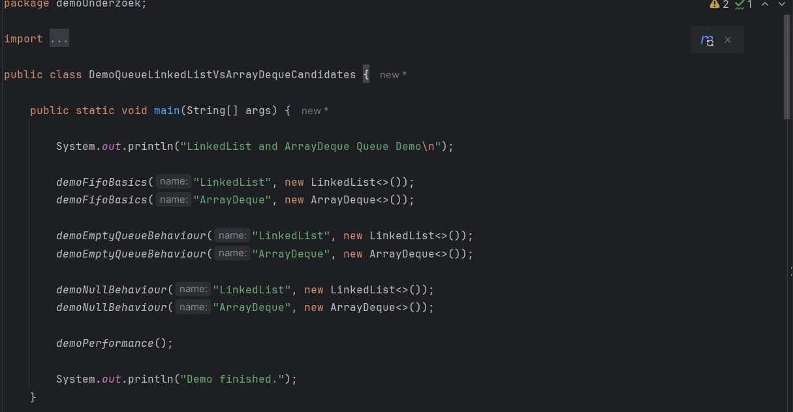
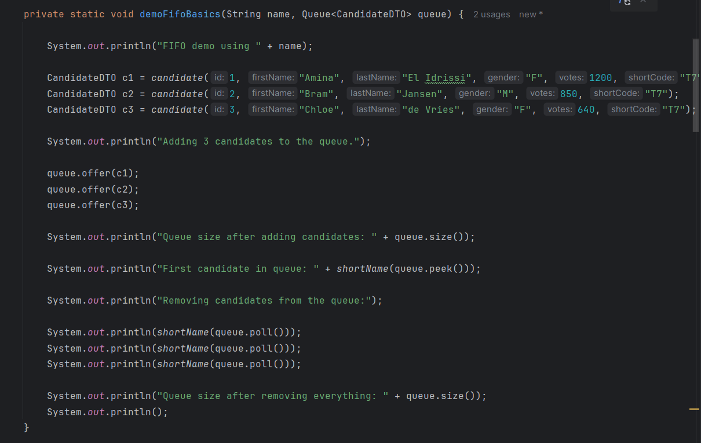
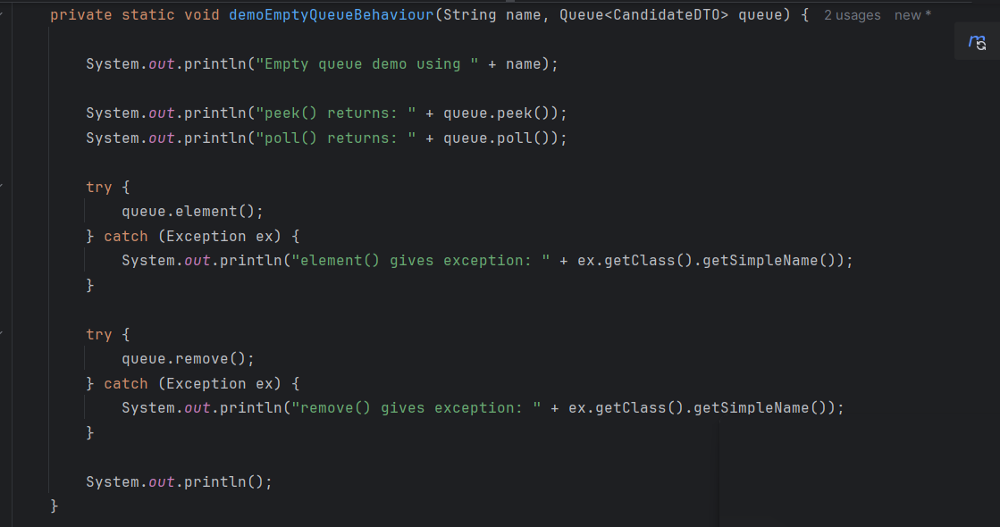
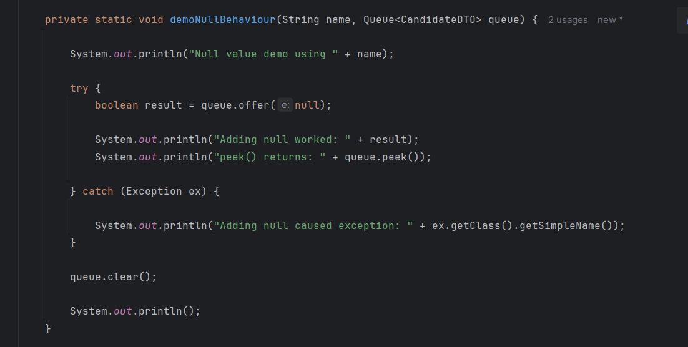
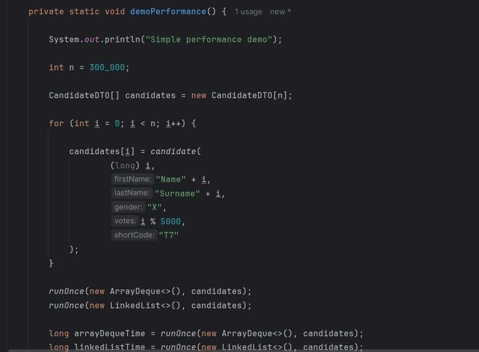
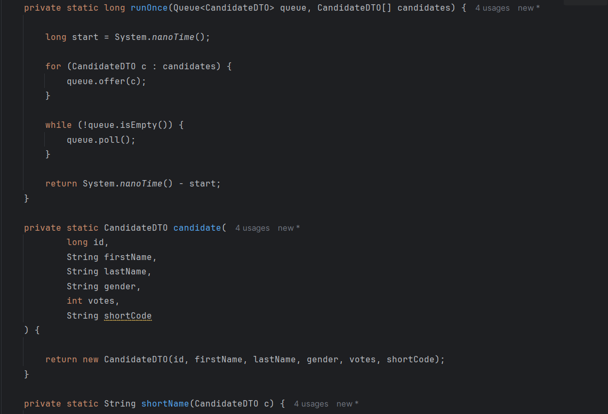
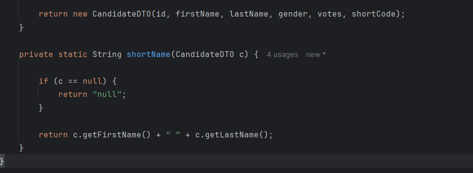

# Research Report
## Comparing LinkedList and ArrayDeque within the Java Queue Interface

# Introduction

Within the Java Collection Framework there are different implementations of the Queue interface. Two commonly used implementations are LinkedList and ArrayDeque (Oracle, 2024). Many beginner Java developers are not always sure which implementation is the best option in certain situations. This can lead to code that is less efficient and uses more memory or processing power than necessary, especially when working with larger applications or large amounts of data.

Queues are used in many real-life applications, such as printer systems, scheduling systems, messaging applications, and order processing software (GeeksforGeeks, 2024). Because queues are widely used in software development, it is important to understand how Queue implementations work and what the differences are between them.

The professional theme of this research is performance efficiency within data structures in the Java Collection Framework. This research also uses an ICT norm framework focused on performance efficiency, maintainability, and efficient memory usage (GeeksforGeeks, 2024).

The purpose of this report is to compare LinkedList and ArrayDeque when they are used as implementations of the Queue interface. The report explains how both implementations work internally, what their advantages and disadvantages are, and in which situations one implementation may be a better choice than the other.

The main research question of this report is:

> Which differences exist between LinkedList and ArrayDeque when using the Queue interface in Java?

To answer this question, the following sub questions are used:

1. What is the Queue interface within the Java Collection Framework?
2. How does the FIFO principle work within a Queue?
3. Which standard methods are used within the Queue interface?
4. How does LinkedList work as an implementation of the Queue interface?
5. How does ArrayDeque work as an implementation of the Queue interface?
6. Which performance differences exist between LinkedList and ArrayDeque?
7. What are the advantages and disadvantages of LinkedList and ArrayDeque?
8. In which situations is LinkedList or ArrayDeque the better choice?

# Research Methods

This research was conducted using literature research and documentation analysis. Information was collected from official Oracle Java documentation and online programming resources such as GeeksforGeeks. These sources were used to compare the internal structure, memory usage, and performance of LinkedList and ArrayDeque.

In addition, a small practical demo was created in Java to test Queue operations such as adding and removing elements. The results of the demo were compared with the information found in the literature.

# Theoretical Framework

This research is based on Java documentation, ICT literature, and online programming resources related to data structures and the Java Collection Framework (Oracle, 2024). The most important concepts discussed in this report are Queue, FIFO, performance, memory usage, LinkedList, and ArrayDeque.

A Queue is a data structure where elements are processed in a specific order. It follows the FIFO principle, which stands for “First In, First Out” (GeeksforGeeks, 2024). This means that the first element added to the queue will also be the first one removed. The Queue interface is part of the Java Collection Framework and contains several methods that can be used to manage elements inside the queue (Oracle, 2024).

Two important implementations of the Queue interface are LinkedList and ArrayDeque. Both classes can be used as a Queue, but they work differently internally (GeeksforGeeks, 2024). Understanding these differences is important because the choice of data structure can affect the performance and memory efficiency of an application.

This research also focuses on performance efficiency and maintainability. Choosing efficient data structures is important because it can help software run faster and use system resources more effectively (GeeksforGeeks, 2024).

# Results

## What is the Queue interface within the Java Collection Framework?

The Queue interface is part of the Java Collection Framework and is mainly used to process elements in a sequential order (Oracle, 2024). Queues are commonly used in systems where tasks need to be processed in the same order as they are received.

## How does the FIFO principle work within a Queue?

A Queue follows the FIFO principle, meaning that the first element inserted into the queue is also the first element removed (GeeksforGeeks, 2024). A simple example of FIFO can be seen in a supermarket line where the first customer entering the line is also the first customer leaving it.

## Which standard methods are used within the Queue interface?

The Queue interface contains several standard methods. Common methods are `add()`, `offer()`, `remove()`, `poll()`, `element()`, and `peek()` (Oracle, 2024). These methods are used to add, remove, or inspect elements in the queue.

The most commonly used Queue methods are shown in the table below:

| Method | Description |
|---|---|
| `add()` | Adds an element to the queue. Throws an exception if it fails. |
| `offer()` | Adds an element to the queue and returns false if it fails. |
| `remove()` | Removes the first element from the queue. Throws an exception if the queue is empty. |
| `poll()` | Removes the first element and returns null if the queue is empty. |
| `element()` | Returns the first element without removing it. Throws an exception if empty. |
| `peek()` | Returns the first element without removing it and returns null if the queue is empty. |

Methods such as `offer()`, `poll()`, and `peek()` are often considered safer because they return special values instead of throwing exceptions when the queue is empty or full (Oracle, 2024).

## How does LinkedList work as an implementation of the Queue interface?

LinkedList is one implementation of the Queue interface. It stores elements using connected nodes (Oracle, 2024). Each node contains the value itself together with references to the next and previous node. Because of this structure, elements can easily be added or removed at the beginning or end of the list. This makes LinkedList flexible for handling dynamic data.

An example of using LinkedList as a Queue is shown below:

```java
Queue<String> queue = new LinkedList<>();

queue.add("Task1");
queue.add("Task2");

queue.remove();
```

Although LinkedList is flexible, it also has disadvantages. Every node stores extra references, which increases memory usage (GeeksforGeeks, 2024). In addition, the elements are stored separately in memory, which can reduce cache efficiency and lower performance compared to array-based structures.

## How does ArrayDeque work as an implementation of the Queue interface?

ArrayDeque is another implementation of the Queue interface. Unlike LinkedList, ArrayDeque uses a resizable array internally (Oracle, 2024). Because the elements are stored closer together in memory, operations are usually performed more efficiently.

An example of using ArrayDeque as a Queue is shown below:

```java
Queue<String> queue = new ArrayDeque<>();

queue.add("Task1");
queue.add("Task2");

queue.poll();
```

ArrayDeque stores elements in contiguous memory locations, which improves cache efficiency and execution speed. It also uses less memory because it does not require extra references between nodes.

## Which performance differences exist between LinkedList and ArrayDeque?

In most situations, ArrayDeque performs faster than LinkedList for Queue operations (GeeksforGeeks, 2024). The array structure allows faster memory access and better overall performance. Another advantage is that ArrayDeque uses less memory because it does not require additional node references.

LinkedList can become slower because every node is stored separately in memory. This can reduce cache performance and increase memory usage.

## What are the advantages and disadvantages of LinkedList and ArrayDeque?

| Feature | LinkedList | ArrayDeque |
|---|---|---|
| Internal structure | Connected nodes | Resizable array |
| Memory usage | Higher | Lower |
| Performance | Slower | Faster |
| Null values | Allowed | Not allowed |
| Flexibility | High | Moderate |

LinkedList is flexible and useful when many insertions or removals are needed at multiple positions in the structure. However, it generally uses more memory and performs slower.

ArrayDeque is usually faster and more memory efficient. However, it does not allow null values and may need to resize its internal array when it becomes full.

## In which situations is LinkedList or ArrayDeque the better choice?

For most Queue applications, ArrayDeque is the preferred implementation. Systems such as task scheduling, message processing, and gaming queues can benefit from its higher performance (GeeksforGeeks, 2024).

LinkedList is mainly useful when flexible node operations are required or when a node-based structure is specifically needed.

# Demo Description

1. Demonstrating FIFO behavior using the methods `offer()`, `peek()`, and `poll()`.

2. Demonstrating the behavior of an empty queue:
    - `peek()` and `poll()` return `null` when the queue is empty.
    - `element()` and `remove()` throw an exception when the queue is empty.

3. Demonstrating the difference in handling null values:
    - `LinkedList` allows `null` values.
    - `ArrayDeque` does not allow `null` values.

4. A small performance demonstration comparing many `offer()` and `poll()` operations on both implementations.













# Conclusion

This research investigated the differences between LinkedList and ArrayDeque when using the Queue interface in Java. Both implementations support FIFO behavior and provide similar Queue methods. However, there are important differences in their internal structure, memory usage, and performance.

LinkedList uses connected nodes, which makes insertion and removal operations flexible. However, this structure also increases memory usage and can reduce performance because the elements are stored separately in memory.

ArrayDeque uses a resizable array and performs Queue operations more efficiently in most situations (Oracle, 2024). It generally provides better execution speed and lower memory usage compared to LinkedList. Because of these advantages, ArrayDeque is usually the better option for standard Queue implementations in Java applications.

Based on the results of this research, it can be concluded that ArrayDeque is the most suitable implementation for most Queue use cases. LinkedList should mainly be used when a node-based structure is specifically required.

# References

- Oracle. (2024). *Java Queue Interface Documentation*. Oracle Documentation.
- Oracle. (2024). *Java LinkedList Class Documentation*. Oracle Documentation.
- Oracle. (2024). *Java ArrayDeque Class Documentation*. Oracle Documentation.
- GeeksforGeeks. (2024). *Queue Interface in Java*.
- GeeksforGeeks. (2024). *ArrayDeque in Java*.
- GeeksforGeeks. (2024). *LinkedList in Java*.